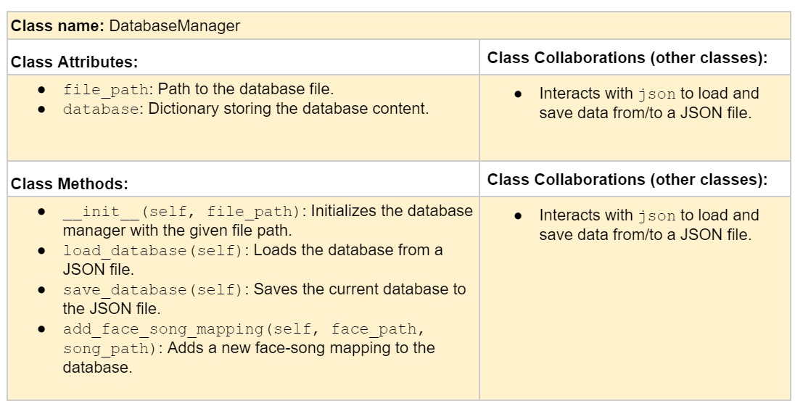
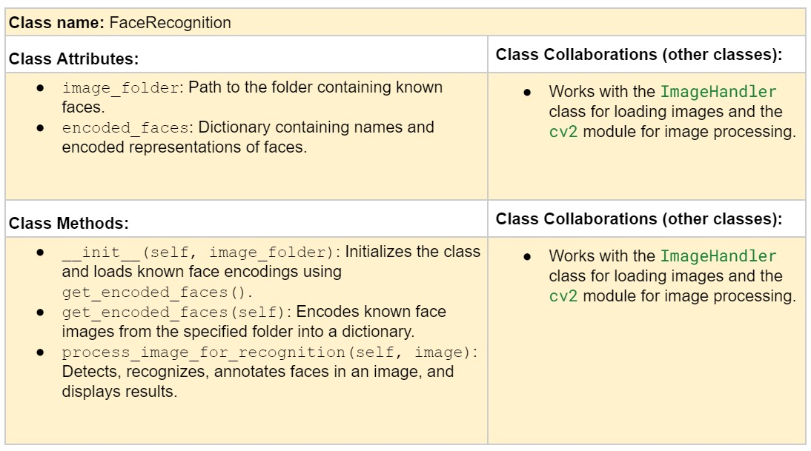
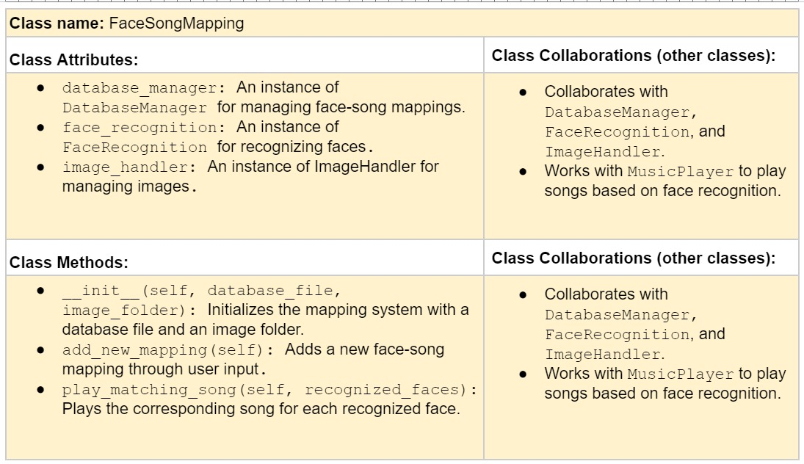
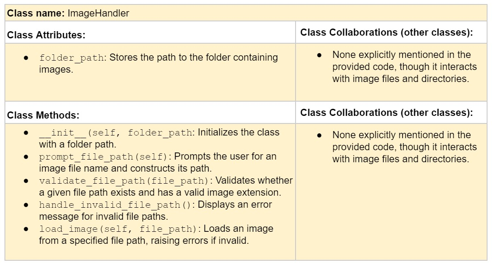
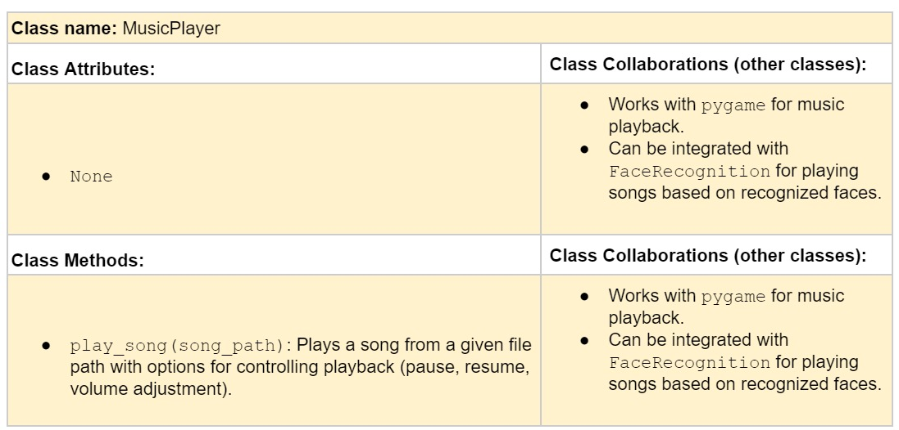

# CSC226 Final Project

## Instructions

**Author(s)**: Eber Seco Lima

**Google Doc Link**: https://github.com/Berea-College-CSC-226/p01-final-project-secolimae

---

## References 
Throughout this project, you have likely used outside resources. Reference all ideas which are not your own, 
and describe how you integrated the ideas or code into your program. This includes online sources, people who have 
helped you, AI tools you've used, and any other resources that are not solely your own contribution. Update as you go.

---

## Milestone 1: Setup, Planning, Design

**Title**: Greet and Beat: Face Recognition Music Player

**Purpose**: This project uses face recognition to detect known faces and automatically play music for each recognized known individual.

**Source Assignment(s)**: [`How to Make Music Player in Python`](https://www.codesnail.com/how-to-make-music-player-in-python/) and [`Python Face Recognition Tutorial w/ Code Download`](https://www.youtube.com/watch?v=D5xqcGk6LEc)

**CRC Card(s)**:
  










**Branches**: secolimae

---

## Milestone 2: Code Setup and Issue Queue

Most importantly, keep your issue queue up to date, and focus on your code. 🙃

Reflect on what you’ve done so far. How’s it going? Are you feeling behind/ahead? What are you worried about? 
What has surprised you so far? Describe your general feelings. Be honest with yourself; this section is for you, not me.

```
    
Working on the face recognition has been harder than I expected. I tried 
breaking the problem down into as many detailed subtasks as possible, but 
the more I break it down, the more I realize the complexity of the problem. 
The music player part seems easier, but integrating it with the face 
recognition application will definitely be a challenge in the coming weeks.
```

---

## Milestone 3: Virtual Check-In

Indicate what percentage of the project you have left to complete and how confident you feel. 

```
40%

I believe the key to feeling more confident about completing this project is 
spending more time with my code, as well as taking breaks to reflect on how 
I can use different methods to achieve my goals. Along the way, I’ve ended 
up with plans that are quite different from what I initially had, especially 
regarding how my classes function. However, now they make more sense to me, 
and the overall picture is clearer. This was only possible with a lot of 
screen time and really thinking about what I wanted to accomplish with my 
code. As for strategies, I plan to implement small, manageable new features 
that align with the existing code I have. This approach will allow me to 
make progress without overwhelming myself, especially as finals 
and other assignments are approaching.
```
---

## Milestone 4: Final Code, Presentation, Demo

When you run the program, the terminal will prompt you to enter an image 
file name (e.g., test.jpg). After entering an existing file name from the 
"Face-Recognition-master" folder (for example, test1.jpeg), the program will 
print the file path in the terminal to confirm that the image is located 
correctly, and it will open the image. Upon opening the image, the program 
will check if there is a known face from the "Face-Recognition-master/faces" 
directory, which contains the known faces. If a match is found, the program will print the name of the identified 
person (e.g., Scott Heggen). The user can then close the image by pressing 
any key on the keyboard.

If a face is detected in the image and it has a song mapped to it, like in 
the case of Scott Heggen, the program will play the associated song and 
display commands in the terminal, such as "Press 'p' to pause," "Press 'r' 
to resume," etc. The user can interact with the terminal to control the 
music playback. If the user presses "r" to resume, there is an option to add a new face-song 
mapping. 

If the identified face doesn’t have a song associated with it, the 
program will print "No song associated with (person's name, e.g., Scott 
Heggen)" and ask if you want to add a new face-song mapping. Pressing 'y' 
will prompt you to enter the person’s name and the corresponding music file 
from the music folder. Once this is done, the program will confirm that the 
mapping was created successfully, and the mapping will be stored in a JSON 
file. To play the song, you will need to hit "Run" again and open the same 
image file.

### Reflection
In three to four well-written paragraphs, address the following (at a minimum):
- Why did you select the project that you did?
```
This project is a combination of two projects, one for face recognition and the other for a music player. I chose to work on this project because I've always wanted to work with computer vision, and face recognition has always fascinated me. I wanted to experience computer vision through this project. Similarly, with music, I wanted to create something that also reflected my interest in music.
```
- How closely did your final project reflect your initial design?
```
I would say about 70% because I didn’t implement the GUI that was required and one of the grading components. Honestly, I hadn’t opened the project PDF for a while, and I simply forgot to implement that functionality. But aside from that, I am happy with my project because I was able to see the face recognition and music player in action.
```
- What did you learn from this process?
```
I learned not to rely only on myself. It’s very difficult to solve things on your own, and that’s something I don’t want to do anymore. It’s hard to have all the answers for everything, and because of that, I often felt incapable of moving forward.
```
- What was the hardest part of the final project?
```
The hardest part was creating the method that connected everything, the magic that linked the face recognition with the music being played. But aside from that, it was also my presentation. I didn’t prepare enough to speak about my code, and I believe that impacted my grade.
```
- What would you do differently next time, knowing what you know now?
```
Next semester, I’ll seek more human help. I relied too much on ChatGPT and online tools, often trying to solve things on my own because I thought it would help me entirely. This led to a lot of insecurity about my code and my ability to write code. I still don’t feel like I’m at the level of knowledge I should be at, but next semester, I want to clear up most of my doubts and projects with TAs and seek help from people who can teach me because I have a lot to learn from them as well.
```
