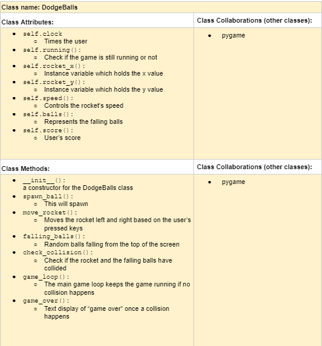

# CSC226 Final Project

️**Author(s)**: Din din

️**Google Doc Link**: https://docs.google.com/document/d/1HVP6fGvnpCJ0lKVme72FM8JZB4IiN9JlbNWyp3xQ2x4/edit?usp=sharing

## References 
Throughout this project, you have likely used outside resources. Reference all ideas which are not your own, 
and describe how you integrated the ideas or code into your program. This includes online sources, people who have 
helped you, AI tools you've used, and any other resources that are not solely your own contribution. Update as you go.

Dr Heggens: for overall layout, gave me ideas on how my layout should look like
-told me to change the objects into sprites, so collision can happen
-Gave me a startup blueprint and I used T11 along with it

ChatGPT: used it to help fix the code for my falling ball issue. 
-I had one ball moving horizontally while moving down, so I used chat to help me fix the code, to where multiple balls are spawned at the top and not just one ball.
-On line 132, pygame.SRCALPHA is used for transparency around the falling red balls
-Using pygame.rect is easier to handle sprite positions and collisions
-helped me display the score in the top left corner of the screen

Tojo: helped me with the inits and also got my screen to work
-helped me start the dodgeballs moving downwards

pygame documentations: used throughout the game, esp for drawing the objects (player and the red circles)
-Used it for event handler
-helped me with this line of code: pygame.time.wait(2000), this exits the game after a second
-helped me position the player at the bottom of the game, and also helped me spawn the player at the center everytime it spawns
-helped me with some of the test suites, I saw some codes on the website, but I didn't really undestand

Nauka: Helped me draw the falling balls on the screen and also with the random radiants (I needed the random radiants for the falling balls)

---
## Milestone 1: Setup, Planning, Design

️**Title**: StarFLARE survival

  **Purpose**: my game is going to have asteriods/balls coming down from the screen and the rocket(main piece) is going to have to dodge them, if not you die.

️**Source Assignment(s)**: T11: The Legend of Tuna: Breath of Catnip
                             T12: Events and GUIs

️**CRC Card(s)**:
  - Create a CRC card for each class that your project will implement.
  - See this link for a sample CRC card and a template to use for your own cards (you will have to make a copy to edit):
    [CRC Card Example](https://docs.google.com/document/d/1JE_3Qmytk_JGztRqkPXWACJwciPH61VCx3idIlBCVFY/edit?usp=sharing)
  - Tables in markdown are not easy, so we suggest saving your CRC card as an image and including the image(s) in the 
    README. You can do this by saving an image in the repository and linking to it. See the sample CRC card below - 
    and REPLACE it with your own:
  
(image/crc.png  ")

```
    Branch 1 name: parn
    Branch 2 name: _____________
```
## Milestone 2: Code Setup and Issue Queue

Most importantly, keep your issue queue up to date, and focus on your code. 🙃

Reflect on what you’ve done so far. How’s it going? Are you feeling behind/ahead? What are you worried about? 
What has surprised you so far? Describe your general feelings. Be honest with yourself; this section is for you, not me.

```
    I feel like I am behind, I was waiting on feedback from milestone 1, and after getting the feedback, I realized that I needed to basically change my outline. The Dodgeball class is suppose to be the GUI class. And most of the methods inside the previous Dodgeball class are suppose
    to be inside the GUI class. And I thought I wouldn't need to create a player class, I thought that would be covered inside either the GUI class or the Dodgeball class. But now I feel a little lost on with methods are suppose to be in which class and what their attributes are going to be.
    I am worried that, I am going to get more lost as I continue to work on this project. Even after asking for help, I feel like once I go back and work on the project by my self, I would get lost too often which sets me back a lot. When I get lost, I tend to shut down or I take a break which 
    can sometimes go longer than expected. I am also scared that when I go to the TAs or the prof for help, I won't be able to explain what problems I am having in a way that I want them to understand. When I get stuck on a problem on something I don't really understand myself, I don't know how 
    to ask proper help. But hopefully I make a lot of progress during Thanksgiving break. 
```

## Milestone 3: Virtual Check-In

  **Completion Percentage**: 55% done

️**Confidence**: Describe how confident you feel about completing this project, and why. Then, describe some 
  strategies you can employ to increase the likelihood that you'll be successful in completing this project 
  before the deadline.

```
    At the beginning of the project, I felt confident and I set the bar a bit too high for myself. I think my confidence is decreasing as we approach the deadline because of my progress. When we do progress check in class, I feel so behind. A lot of people are above 50% before milestone 3
    but I just now passed my 50% mark and I feel very behind compared to my classmates. To complete this project on time, instead of being stuck by myself, if I take more than a day to fix a bug and I still can't do it, I go to TA hours now. Because the deadline is approaching, I am trying to 
    manage my time well and get the help while I still can. When I go to TA hours and they explain me codes, when I go back to my dorm, I like to go through it to make sure I actually understand. By doing this I feel like I can finish on time.
```

## Milestone 4: Final Code, Presentation, Demo

### User Instructions
In my game, you have falling red balls (dodgeballs), and the rocket (green block). The goal is to avoid the falling red balls as long as you can. The rocket can only move left or right.
When the user hits run, you will use the left or right keys on the laptop to move the rocket around to avoid collision between the red falling balls and the rocket. A timer is present in
the top left corner of the screen, this is to see how long you lasted. I have the score label set up in the top left corner, but it doesn't work.

### Errors and Constraints
Every program has bugs or features that had to be scrapped for time. These bugs should be tracked in the issue queue. 
You should already have a few items in here from the prior weeks. Create a new issue for any undocumented errors and 
deficiencies that remain in your code. Bugs found that aren't acknowledged in the queue will be penalized.

### Reflection
In three to four well-written paragraphs, address the following (at a minimum):
- Why did you select the project that you did?
- How closely did your final project reflect your initial design?
- What did you learn from this process?
- What was the hardest part of the final project?
- What would you do differently next time, knowing what you know now?
- (For partners) How well did you work with your partner? What made it go well? What made it challenging?

    I selected this project because it's a simple game I used to play when I was younger. The game that I made is way more simple than the game I used to play. I thought that this game would be easy enough for me to fully get the game logic behind it, but also hard enough to 
challenge me to create a game from scratch and learn the game logics. I also chose this project because we have done similar projects in teamwork's or our homeworks, so if I got stuck, I had something to fall back on. The turnout for my project from the initial design is closer
than it is different. I mean I didn't get to implement all the cool enhancements like the score update, restart button, and when you die it shows your final score on the screen. I have the score showing in the top right corner, but it doesn't update, it stays at 0. But overall, 
the final outcome is just a much simpler version of my initial design. 
    This project has taught me a lot of things. I didn't know about the pygame documentation before this project, but after starting this project, I found the pygame documentation. It has a lot of cool features for pygame, and it helped me alot during this process. I also learned 
how difficult it is to make a simple game. The lines of code that goes in for a simple game like trying to dodge falling balls from the top. But the biggest realization that I learned from this project is how I really struggle with test suites. I made one but it doesn't even work. 
I tried looking at previous test suites but none of them were pygame and used classes. So I tried my best and used one of the previous test suites from the bar codes assignment and attempted.
    The hardest part of this project was the final stretch. Actually I don't know what was harder, the beginning or the end. In the beginning, I struggled a lot because I didn't know all the right functions and how to do the layout. I was confused on which method belonged in which class.
But this problem got solved in class, when we worked on our final project in class, I was able to get feedback quick and this helped my process. I would work on the code by myself, and ask the professor to look it over to see of my structure was correct. After fixing my layout, it went smoother,
because I now knew what needed to happen in each section. The final stretch was also really challenging for me because instead of working on one issue at a time, I would jump around and fix the easier one first. So at the end, the harder ones remained so debugging them was challenging.
The main issue I had was the collision part. At first, I didn't have sprites, and it was harder to do the collision, but after asking the professor, he advised me to change them into sprites. After changing them into sprites, I had T11 to help me through the collision logics.
    If I had to do this again, I would do a lot of things differently. First and foremost, I would spend more time on this project. One of my bad habits is shutting down when I am stuck. So next time instead of taking a break, I should push myself to fix the problem and then take a break. If I had
spent more time on this project maybe I could've gotten help from either the TAs or the professor in regard to my enhancements. If I had spent more time, my test suite would've ben better and might have actually worked. I was so focused on the code, that I forgot about the test suites, so when I remembered
it was too late to ask for help. Asking the professor how test suites would look with pygame during class time would've been a huge help, because he would be there to give me live feedback and help me understand it better. Overall, I feel like this project really did a good job on testing our knowledge. 
I struggled a lot, but also at the sametime, I learned a lot. 
    