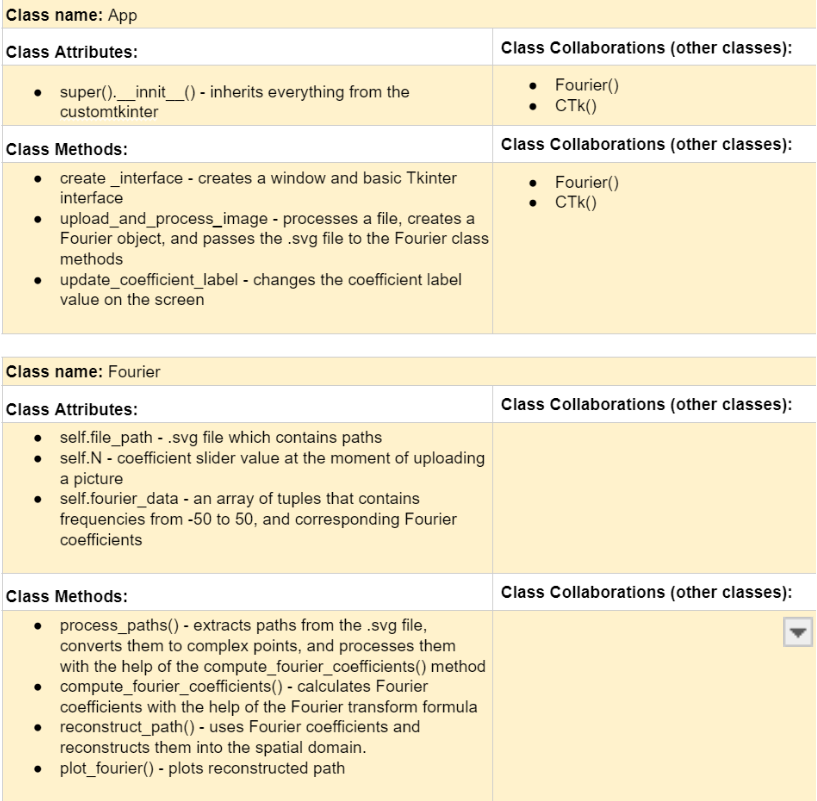

# CSC226 Final Project

## Instructions

**Author(s)**: Aliaksandr Melnichenka, Denys Zhytkov

**Google Doc Link**: https://docs.google.com/document/d/1ZK77FyNEYp8gqzuxePRUzWHmlx4yx0-cRypP0PMwDbE/edit?tab=t.0

**GitHub repository**: https://github.com/Berea-College-CSC-226/p01-final-project-melnichenkaa-zhytkovd

---

## References 
Throughout this project, you have likely used outside resources. Reference all ideas which are not your own, 
and describe how you integrated the ideas or code into your program. This includes online sources, people who have 
helped you, AI tools you've used, and any other resources that are not solely your own contribution. Update as you go.

---

## Milestone 1: Setup, Planning, Design

**Title**: `Image Processing Through Fourier Transforms.`

**Purpose**: `The processing image through the Fourier Transforms for making vector, explicitly functionally-defined image, potentially recovering possible lost data as well as optimising the size of the images themselves.`

**Source Assignment(s)**: `https://www.youtube.com/watch?v=r6sGWTCMz2k, https://www.youtube.com/watch?v=spUNpyF58BY, https://github.com/3b1b/3Blue1Brown.com/tree/main/public/content/lessons/2019/fourier-series, https://www.youtube.com/watch?v=bpn3DEULv8g, https://www.youtube.com/watch?v=ds0cmAV-Yek`

  


**Branches**: This project will **require** effective use of git. 

Each partner should create a branch at the beginning of the project, and stay on this branch (or branches of their 
branch) as they work. When you need to bring each others branches together, do so by merging each other's branches 
into your own, following the process we've discussed in previous assignments: 

```
    Branch 1 name: melnichenkaa
    Branch 2 name: zhytkovd
```
---

## Milestone 2: Code Setup and Issue Queue

Most importantly, keep your issue queue up to date, and focus on your code. 🙃

Reflect on what you’ve done so far. How’s it going? Are you feeling behind/ahead? What are you worried about? 
What has surprised you so far? Describe your general feelings. Be honest with yourself; this section is for you, not me.

```
    We had many issues implementing our idea at this point of the project. 
    We started with the interface design using web development tools. 
    The website was written, but we got stuck implementing JavaScript and Python together. 
    We decided to work on the math part first and then deal with the design. 
    Alex and I feel confident about this project and think we can finish it on time
```

---

## Milestone 3: Virtual Check-In

Indicate what percentage of the project you have left to complete and how confident you feel. 

**Completion Percentage**: `80%`

**Confidence**: Describe how confident you feel about completing this project, and why. Then, describe some 
  strategies you can employ to increase the likelihood that you'll be successful in completing this project 
  before the deadline.

```
    We are confident that we will finish the project on time and will have some time to polish it. 
    Instead of using web development tools, we used the Matplotlib library to visualize 
    our reconstructed path. At the same time, we used customtkinter to create a modern-looking
    interface for our program. Program is ready and working, but we still need to add documentation and
    additional functions.    
    
    A strategy that helped us a lot is pair programming. We discovered that meeting in any study
    place and doing programming on one laptop together allowed us to develop more effective
    algorithms. Generally, working together was more enjoyable than writing the code alone, 
    which also sped up the process. 
```

---

## Milestone 4: Final Code, Presentation, Demo

### User Instructions
In a paragraph, explain how to use your program. Assume the user is starting just after they hit the "Run" button 
in PyCharm.
```
When you open the program, you will see two buttons and a slider. The slider determines how many Fourier Coefficients 
will be used for calculations. In simple words, it means how precise the picture will be. You can choose from 1 to 100. 
With the help of the button “Upload Image” you can open a dialog box for choosing a file and choose an .svg file. 
Or, you can use the “Capture Photo” button, which will take a picture from your web camera. 
After that, you will see a graph with an approximation of your picture.

```

### Errors and Constraints
Every program has bugs or features that had to be scrapped for time. These bugs should be tracked in the issue queue. 
You should already have a few items in here from the prior weeks. Create a new issue for any undocumented errors and 
deficiencies that remain in your code. Bugs found that aren't acknowledged in the queue will be penalized.

### Reflection
In three to four well-written paragraphs, address the following (at a minimum):
```
- Why did you select the project that you did?
    Initially, before the start of the project, we wanted to do something unusual and challenging enough. 
    When we were at the stage of choosing the idea of the project, Alex found a you-tube video about the 
    Fourier transform. This video became our inspiration for a project. The goal was to upload a .svg image, 
    parse the paths, extract complex points from it, compute Fourier coefficients, and reconstruct it into the special domain. 
- How closely did your final project reflect your initial design?
    Throughout the project, we changed the design of our program fully several times. The main problem was the algorithm 
    of the Fourier transform and the design of the graphics. We started with web development tools and spent more than 
    two weeks, trying to figure out how to accomplish our goals through it. Although it was really close to the final 
    goal, we decided to consider another, more effective, way of doing it. We spent a few days researching if PyGame, 
    Tkinter, or Turtle Library might be the right choice for us and decided to start from scratch with Tkinter. 
    A little bit later we came out with the math formulas for our project, and our design choice was finalized.
- What did you learn from this process?
    We learned a lot of technical and communication skills throughout the project. We needed to study dozens of different
    libraries to find the ones that suited our project the best. Apart from that, we gained a profound understanding of 
    the Fourier series transform and Python design concepts overall. We learned how to communicate with each other effectively
    to accomplish our goals faster and more efficiently. By the end of the project, Alex and I felt the strong team connection 
    and could perform the same tasks much faster together, compared to the beginning of the project.
- What was the hardest part of the final project?
    The hardest part was conquering the fear of starting from scratch after two weeks of doing the project. Apart from that, 
    it was really hard to approximate the time to complete the task. For example, when we were working on the math formula,
    we thought that It would take a few hours of teamwork to figure it out. However, we spent almost a week getting it to
    satisfactory results. Almost every other aspect of our final project took much more time than we were expecting.
- What would you do differently next time, knowing what you know now?
    First, we would plan our time differently because everything took much longer than we expected. Secondly, although
    we had a lot of in-person-meetings, we would prefer to have even more of them, because during them we had the most amount of progress and fun. 
- (For partners) How well did you work with your partner? What made it go well? What made it challenging?
    We communicated very well: plenty of in-person-meetings and constant communication in the social media. Our different
    schedules made it a little bit harder to meet, but generally, we communicated about every task or problem that we had. 
    When we were together, we used the pair programming approach, which also helped us to build a strong team.
```
