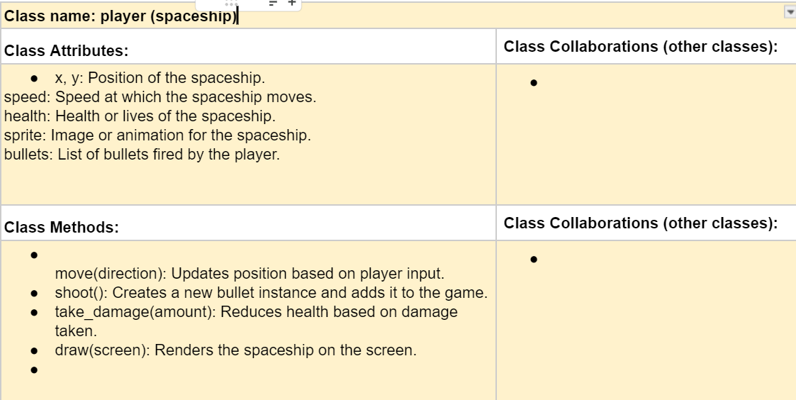
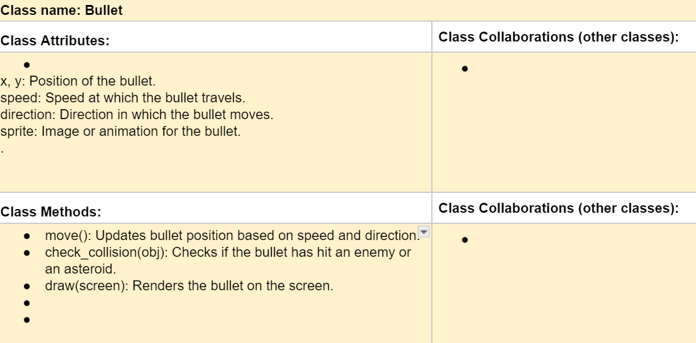

# ❗CSC226 Final Project

## Instructions

❗️Exclamation Marks ❗️indicate action items; you should remove these emoji as you complete/update the items which 
  they accompany. (This means that your final README should have no ❗️in it!)

❗️**Author(s)**: Your name(s) here

❗️**Google Doc Link**: Your link here

---

## References 
Throughout this project, you have likely used outside resources. Reference all ideas which are not your own, 
and describe how you integrated the ideas or code into your program. This includes online sources, people who have 
helped you, AI tools you've used, and any other resources that are not solely your own contribution. Update as you go.

---

## Milestone 1: Setup, Planning, Design

❗️**Title**: `Space Shooter (A Game).`

❗**Purpose**: `In a single sentence, describe WHAT your project will do. It will be a game that has a  space shooter in the form of a 2D arcade game where players take control of a spacecraft, avoid asteroids, and destroy opposing ships. For handling animations and images, use the Pygame library..`

❗️**Source Assignment(s)**: `List which original assignments you will base your project on? T11: The Legends of Tuna: Breath of Catnip.`

❗️**CRC Card(s)**:
  - Create a CRC card for each class that your project will implement.
  - See this link for a sample CRC card and a template to use for your own cards (you will have to make a copy to edit):
    [CRC Card Example](https://docs.google.com/document/d/1JE_3Qmytk_JGztRqkPXWACJwciPH61VCx3idIlBCVFY/edit?usp=sharing)
  - Tables in markdown are not easy, so we suggest saving your CRC card as an image and including the image(s) in the 
    README. You can do this by saving an image in the repository and linking to it. See the sample CRC card below - 
    and REPLACE it with your own:
  
, 


❗️**Branches**: This project will **require** effective use of git. 

Each partner should create a branch at the beginning of the project, and stay on this branch (or branches of their 
branch) as they work. When you need to bring each others branches together, do so by merging each other's branches 
into your own, following the process we've discussed in previous assignments: 

```
    Branch 1 name:ngogj
    Branch 2 name: _____________
```
---

## Milestone 2: Code Setup and Issue Queue

Most importantly, keep your issue queue up to date, and focus on your code. 🙃

Reflect on what you’ve done so far. How’s it going? Are you feeling behind/ahead? What are you worried about? 
What has surprised you so far? Describe your general feelings. Be honest with yourself; this section is for you, not me.

```
    **I feel ahead because i know what i want to do and have a set plan on what i want to do. Its going to be a long hard project but if i work on it dillgently then i feel like i could get it done on time but the code is fine becausing its based off an assignment we already did which has to do with pygame.
```

---

## Milestone 3: Virtual Check-In

Indicate what percentage of the project you have left to complete and how confident you feel. 

❗️**Completion Percentage**: `70%`

❗️**Confidence**: Describe how confident you feel about completing this project, and why. Then, describe some 
  strategies you can employ to increase the likelihood that you'll be successful in completing this project 
  before the deadline.

```
    **I feel very confident that i will finish my project on time. Im having a lot of fun on it but this project is challenging my problem solving with my code and trying to figure out how to make my game run smoothly. Strateges i can use and just completing little bits of code each day to eventually get done with it.
```

---

## Milestone 4: Final Code, Presentation, Demo

### ❗User Instructions
In a paragraph, explain how to use your program. Assume the user is starting just after they hit the "Run" button 
in PyCharm. 
**
After hitting the "Run" button, the Space Shooter game will launch in a new window. Your objective is to control the white rectangular player at the bottom of the screen using the arrow keys on your keyboard. Press the left arrow key to move left and the right arrow key to move right. To shoot bullets, press the spacebar. Red rectangular enemies will appear from the top of the screen and move downward; your goal is to shoot them for points while avoiding collisions. Every 20 points, a large blue boss will appear at the top of the screen, moving side to side. The boss requires multiple hits to defeat and rewards bonus points upon destruction. Keep an eye on your health, displayed at the top left, as collisions with enemies or the boss will decrease it. The game ends when your health reaches zero, at which point a "Game Over" message will be displayed. Try to achieve the highest score possible!**
### ❗Errors and Constraints
Every program has bugs or features that had to be scrapped for time. These bugs should be tracked in the issue queue. 
You should already have a few items in here from the prior weeks. Create a new issue for any undocumented errors and 
deficiencies that remain in your code. Bugs found that aren't acknowledged in the queue will be penalized.

### ❗Reflection
In three to four well-written paragraphs, address the following (at a minimum):
- Why did you select the project that you did?
- How closely did your final project reflect your initial design?
- What did you learn from this process?
- What was the hardest part of the final project?
- What would you do differently next time, knowing what you know now?
- (For partners) How well did you work with your partner? What made it go well? What made it challenging?
**I chose the space shooter game because it displayed it combines several interesting programming concepts, including object-oriented design, event handling, and collision detection. These are fundamental skills for game development, making this project both a challenge and an opportunity to solidify my understanding of these topics. Additionally, a Space Shooter game offers room for creativity and iterative improvement, from introducing power-ups to adding boss battles. This type of project is also interactive, providing immediate feedback on changes and fostering a sense of accomplishment upon completion.

The final project closely aligned with my initial design in terms of functionality, with players able to shoot enemies, earn points, and encounter boss battles at score intervals. However, as I worked through the development process, new features like health tracking and dynamic difficulty scaling were added to enhance gameplay. These features improved the game's balance and kept it engaging as the player progressed. While the initial concept focused mainly on basic mechanics, the iterative design process allowed me to expand the game into something more comprehensive and polished.
Through this process, I learned the importance of breaking down a complex project into manageable components. Writing code for player movement, enemy spawning, and collision detection in isolation before integrating them into the larger game made the development process smoother and easier to debug. I also gained valuable insights into balancing game difficulty by adjusting variables such as enemy speed and spawn rate. Most importantly, I learned how to adapt and iterate on my design, responding to challenges and opportunities as they arose during implementation.
The hardest part of the final project was managing the interactions between multiple game objects, such as ensuring that bullets collided properly with both enemies and the boss, without causing unexpected behavior like removing the wrong objects. Debugging these interactions required careful attention to how game states were updated and ensuring lists of objects were handled safely during iteration. Designing the boss mechanics, with its health system and movement logic, was particularly challenging, as it required integrating several new features while keeping the gameplay smooth and intuitive.
If I were to start over, I would focus more on planning the game's structure before jumping into coding. Designing a clear blueprint for how game objects interact, their attributes, and their states would have saved time spent refactoring during later stages. I would also consider starting with placeholder designs for advanced features like power-ups or boss battles, adding complexity incrementally instead of tackling these features late in development. Knowing what I know now, I would also dedicate more time to testing and optimizing performance, ensuring the game runs smoothly regardless of how many objects are on the screen.
Also throughout my project and i had trouble figuring out a lot of features that i wanted to add in but it just added on a lot of bugs but overall it was a fun project to make that taught a lot more about pygame and classes and objects.
- **