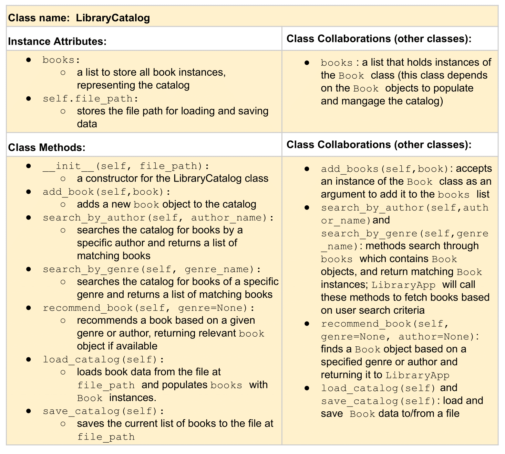
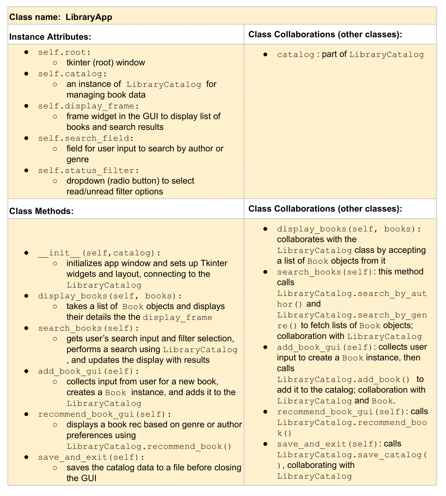
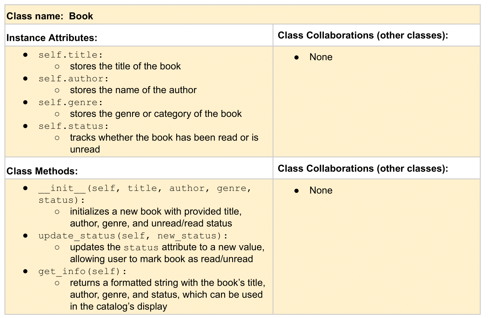

# CSC226 Final Project

## Instructions

**Author(s)**: Galina Pokitko

**Google Doc Link**: https://docs.google.com/document/d/1YVjtTpscTAyy8Pr9ZcvsWHNJgY5wRfYCbZwOVURcls4/edit?tab=t.0

---

## References 
Throughout this project, you have likely used outside resources. Reference all ideas which are not your own, 
and describe how you integrated the ideas or code into your program. This includes online sources, people who have 
helped you, AI tools you've used, and any other resources that are not solely your own contribution. Update as you go.

Inspired by Goodreads: https://www.goodreads.com/

Book databases information: https://www.db2tutorial.com/getting-started/db2-sample-database/

Sqlite tutorial by Corey Schafer: https://www.youtube.com/watch?v=pd-0G0MigUA&ab_channel=CoreySchafer

Libraries used: https://docs.python.org/3/library/sqlite3.html#tutorial and https://docs.python.org/3/library/tkinter.html

Introduction to tkinter with sqlite: https://www.youtube.com/watch?v=gdDI_GhIRGo&ab_channel=CodeFirstwithHala

Overview of DB Browser: https://datacarpentry.github.io/sql-socialsci/02-db-browser.html

Retrieving sqlite data: https://stackoverflow.com/questions/63235485/python-tinker-sqlite3-retrieve-data-and-show-on-tkinter-gui

Importing CSV file to Sqlite DB Browser: https://www.youtube.com/watch?v=TOqI-KiTBKU&ab_channel=Anujshah

Borrowed some ideas from CodersLegacy for Python SQLite3 with Tkinter GUI: https://www.youtube.com/watch?v=K8RjdrkaxT0&ab_channel=CodersLegacy

Assisted on project by Scott Heggen

---

## Milestone 1: Setup, Planning, Design

️**Title**: `Library Catalog`

️**Source Assignment(s)**: `I am basing this project off of T12`

️**CRC Card(s)**:
  - Create a CRC card for each class that your project will implement.
  - See this link for a sample CRC card and a template to use for your own cards (you will have to make a copy to edit):
    [CRC Card Example](https://docs.google.com/document/d/1JE_3Qmytk_JGztRqkPXWACJwciPH61VCx3idIlBCVFY/edit?usp=sharing)
  - Tables in markdown are not easy, so we suggest saving your CRC card as an image and including the image(s) in the 
    README. You can do this by saving an image in the repository and linking to it. See the sample CRC card below - 
    and REPLACE it with your own:
  





**Branches**: 

```
    Branch 1 name: pokitkog
```
---

## Milestone 2: Code Setup and Issue Queue

Most importantly, keep your issue queue up to date, and focus on your code. 🙃

Reflect on what you’ve done so far. How’s it going? Are you feeling behind/ahead? What are you worried about? 
What has surprised you so far? Describe your general feelings. Be honest with yourself; this section is for you, not me.

```
    I am a bit lost and feeling behind but am looking at tutorials for sqlite and figuring out how to use it now. I am worried
    about implementing it wrong or not having enough time to add all the features I want, but I am going to take this one step
    at a time. I do have a vision of what I want to do from here so I am a bit more focused than first week. I imported sqlite
    this week and looked into how to use it which is a great first step.
```

---

## Milestone 3: Virtual Check-In

Indicate what percentage of the project you have left to complete and how confident you feel. 

**Completion Percentage**: `70%`

**Confidence**: Describe how confident you feel about completing this project, and why. Then, describe some 
  strategies you can employ to increase the likelihood that you'll be successful in completing this project 
  before the deadline.

```
   I do not feel confident at all in completing this project because I feel like I am still very bad at coding and new
   to using sqlite in order to create a database. To increase the likelihood to be more successful in completing this project
   before the due date, I want to visit lab hours and consider spending some time educating myself further on sqlite through
   tutorials and practice (creating separate branch!).
```

---

## Milestone 4: Final Code, Presentation, Demo

### ❗User Instructions
In a paragraph, explain how to use your program. Assume the user is starting just after they hit the "Run" button 
in PyCharm. 

After running my following program in Pycharm, a GUI window will appear, displaying options to interact with the book
database. To search for books, locate the "Search Books" button, click on it to interact. It will bring you to a new 
window display where it will ask you to "Search by Author". In the text field provided input a valid author name within
the database to obtain results after clicking on the "Search" button. If the book is within the database, all of its
information will display from ISBN to page numbers to published date. If the author is invalid, the program will let you
know that "No books found" in the following database. You can clear the search field and enter a new author's name to
perform another search. The interface also includes an "Exit" button that will exit the program for you.

### ❗Errors and Constraints
Every program has bugs or features that had to be scrapped for time. These bugs should be tracked in the issue queue. 
You should already have a few items in here from the prior weeks. Create a new issue for any undocumented errors and 
deficiencies that remain in your code. Bugs found that aren't acknowledged in the queue will be penalized.

### ❗Reflection
In three to four well-written paragraphs, address the following (at a minimum):
- Why did you select the project that you did?
- How closely did your final project reflect your initial design?
- What did you learn from this process?
- What was the hardest part of the final project?
- What would you do differently next time, knowing what you know now?
- (For partners) How well did you work with your partner? What made it go well? What made it challenging?

I selected the following project it was something I never had any experience with yet wanted to try. Through this project,
I was able to learn a lot and become more well acquainted with sqlite and databases. I chose this project because it is the 
sort of personal project I would like to keep working on even after I am done with it as my final project, so I can use it 
for personal use as for my own books that I read. Furthermore, from this project, I have some other creative idea's I want
to explore for future databases which I can build from this project (such as creating a Travel log or Memory Keeper like a 
digital scrapbook)!

I think I did really well in getting my project to reach what I wanted because all of its features work aside from checking and 
marking whether a book is read or unread. Even though I didn't reach this point yet, I know I will get there, as I will try to
keep working on it over winter break for fun! Of course my initial design isn't exactly the same as where my project is at now, but
that is because I come up with new ideas and concepts along the way that may fit better or just are easier to code! I put in a lot
of time and effort in figuring out how to work with databases and db browser, so I was able to learn a lot about that. I also have
a better understanding of how classes work because I had to use three for this project and ensure I kept track of how each on
interacted with one another in order to work. 

From this process, I learned how important it is to be consistent with this work. It takes a lot of time, bug and errors to get through,
and you will not get from 0 to 100 in a week. You need to debug code and be diligent in your notes, spend time to actually get help when
you are stuck either from someone or look into sources outside this class for help. The hardest part of this project for me was figuring
out how the db browser database could be a part of my code so that it would display on my GUI. A lot of the time, the buttons would work,
but it wouldn't display anything. I had to figure out how to correctly work with the lists and tuples structure of the files, with the help
of the Professor and my test_suite, I was able to derive the issue of how it was stored to fix it. 

Next time, I am going to start with having less classes. I feel like it was completely unnecessary and made my own life harder having to keep
track of everything all at once. When I was faced with a problem, I had a lot more tracing I needed to do because everything was so interlinked.
If the structure was more streamline, I would have spent less time debugging and more time adding better and newer features or idea's that I'd
come up with. Another thing I would do differently is focusing more on writing my issues in the issue queue on GitHub and using my test_suite. 
Although I did both of these things, I wasn't as consistent with it as I was working with my code in Pycharm, working with sqlite in DB Browser,
and researching more information about databases online through YouTube or the library. In all, this project taught me a lot about responsibility,
consistency, coding, experience, and commitment. To create bigger projects, I not only need motivation but the ability to keep pushing through
when it gets hard to not only learn more about new ways to code but built a foundation for understanding code and Python as a computer scientist.