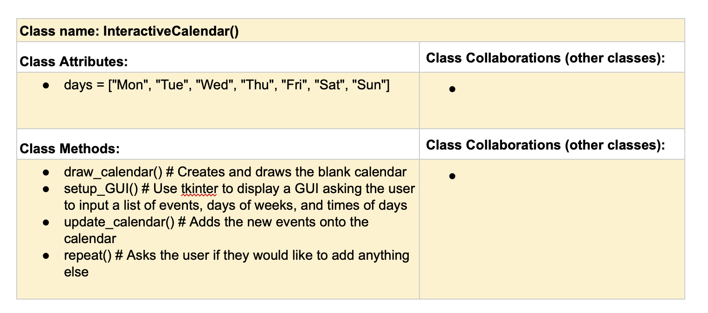

# CSC226 Final Project

## Instructions

**Author(s)**: Caleb Tucker

**Google Doc Link**: https://docs.google.com/document/d/1vX0l7eYSyMq7hrGQ3lBo1ySmjEgRt-y--VKfjIdKzww/edit?usp=sharing

---

## References 
Throughout this project, you have likely used outside resources. Reference all ideas which are not your own, 
and describe how you integrated the ideas or code into your program. This includes online sources, people who have 
helped you, AI tools you've used, and any other resources that are not solely your own contribution. Update as you go.

`Python Documentation and Runestone Academy for what different tk things do.`

## Milestone 1: Setup, Planning, Design

**Title**: `Berea Busy-ness Manager`

**Purpose**: `My project will allow the user to interactively add events to a weekly planner using GUI and interactive features.`

**Source Assignment(s)**: `T12 - Events and GUIs`

**CRC Card(s)**:
  - Create a CRC card for each class that your project will implement.
  - See this link for a sample CRC card and a template to use for your own cards (you will have to make a copy to edit):
    [CRC Card Example](https://docs.google.com/document/d/1JE_3Qmytk_JGztRqkPXWACJwciPH61VCx3idIlBCVFY/edit?usp=sharing)
  - Tables in markdown are not easy, so we suggest saving your CRC card as an image and including the image(s) in the 
    README. You can do this by saving an image in the repository and linking to it. See the sample CRC card below - 
    and REPLACE it with your own:
  


**Branches**: This project will **require** effective use of git. 

Each partner should create a branch at the beginning of the project, and stay on this branch (or branches of their 
branch) as they work. When you need to bring each others branches together, do so by merging each other's branches 
into your own, following the process we've discussed in previous assignments: 

```
    Branch 1 name: tuckerc
    Branch 2 name: _____________
```
---

## Milestone 2: Code Setup and Issue Queue

Most importantly, keep your issue queue up to date, and focus on your code. 🙃

Reflect on what you’ve done so far. How’s it going? Are you feeling behind/ahead? What are you worried about? 
What has surprised you so far? Describe your general feelings. Be honest with yourself; this section is for you, not me.

```
    I feel like I'm making decent progress toward a finished product. There's definitely some bugs, but bugs can always be squashed.
```

---

## Milestone 3: Virtual Check-In

Indicate what percentage of the project you have left to complete and how confident you feel. 

**Completion Percentage**: `70%`

**Confidence**: Describe how confident you feel about completing this project, and why. Then, describe some 
  strategies you can employ to increase the likelihood that you'll be successful in completing this project 
  before the deadline.

```
    I can definitely complete the project. Some methods I can use to be successful before the deadline are to do more troubleshooting, fix the existing bugs, and improve functionality.
```

---

## Milestone 4: Final Code, Presentation, Demo

### User Instructions
In a paragraph, explain how to use your program. Assume the user is starting just after they hit the "Run" button 
in PyCharm.

This program displays a graphical weekly calendar, and you have the ability to add entries to it. Enter any class
name you like, and in 24 hour HH:MM format, fill in the start time and end time. Then, select the days of the week
the event will be on. After this, click Add Class, and the event will appear on the calendar!

### Errors and Constraints
Every program has bugs or features that had to be scrapped for time. These bugs should be tracked in the issue queue. 
You should already have a few items in here from the prior weeks. Create a new issue for any undocumented errors and 
deficiencies that remain in your code. Bugs found that aren't acknowledged in the queue will be penalized.

### Reflection
In three to four well-written paragraphs, address the following (at a minimum):
- Why did you select the project that you did?
- How closely did your final project reflect your initial design?
- What did you learn from this process?
- What was the hardest part of the final project?
- What would you do differently next time, knowing what you know now?
- (For partners) How well did you work with your partner? What made it go well? What made it challenging?

I had the idea for this project after Berea removed the calendar functionality from EAB Navigate360. I quite enjoyed
the feature, so I had the idea that I could potentially recreate the feature for myself.

My final project is a lot closer to the idea I had than I thought I would reach. While it definitely hasn't reached
the level of functionality that the original feature had, it is still very cool.

The hardest part of the project were the finishing touches - going beyond basic functionality, and diving deeper into
tkinter to learn how to more effectively make the GUI pretty. There are so many different ways I could have designed
a calendar, and deciding between them was difficult.

During this process, I learned that I always have the ability to learn to use completely new libraries to make
something beautiful. If I had the change to redo this project, I would spend more time trying to implement a
feature to save the calendar into a file.